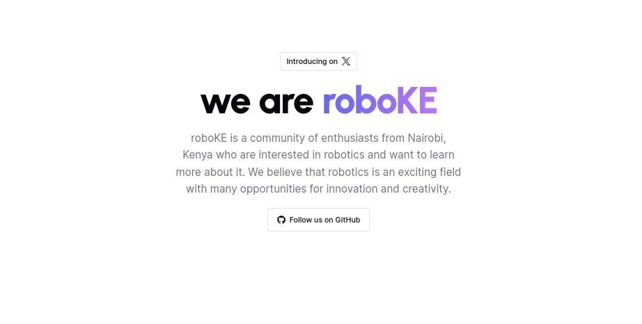

<a href="https://robo.ke">
  
  <h1 align="center">RoboKE website</h1>
</a>

## Installation

1. Install dependencies using pnpm:

    ```sh
    pnpm install
    ```

2. Copy `.env.example` to `.env.local` and update the variables.
  
    ```sh
    cp .env.example .env.local
    ```

3. Start the development server:

    ```sh
    pnpm dev
    ```

### Frameworks

[Next.js](https://nextjs.org/) – React framework for building performant apps with the best developer experience

### UI

* [Tailwind CSS](https://tailwindcss.com/) – Utility-first CSS framework for rapid UI development
* [Shadcn/ui](https://ui.shadcn.com/) – Re-usable components built using Radix UI and Tailwind CSS
* [Framer Motion](https://framer.com/motion) – Motion library for React to animate components with ease
* [Lucide](https://lucide.dev/) – Beautifully simple, pixel-perfect icons
* [`next/font`](https://nextjs.org/docs/basic-features/font-optimization) – Optimize custom fonts and remove external network requests for improved performance
* [`ImageResponse`](https://nextjs.org/docs/app/api-reference/functions/image-response) – Generate dynamic Open Graph images at the edge

### Hooks and Utilities

* `useIntersectionObserver` –  React hook to observe when an element enters or leaves the viewport
* `useLocalStorage` – Persist data in the browser's local storage
* `useScroll` – React hook to observe scroll position ([example](https://github.com/mickasmt/precedent/blob/main/components/layout/navbar.tsx#L12))
* [`use-debounce`](https://www.npmjs.com/package/use-debounce) – Debounce a function call / state update

### Code Quality

* [TypeScript](https://www.typescriptlang.org/) – Static type checker for end-to-end typesafety
* [Prettier](https://prettier.io/) – Opinionated code formatter for consistent code style
* [ESLint](https://eslint.org/) – Pluggable linter for Next.js and TypeScript

## Author

Created by [@miickasmt](https://twitter.com/miickasmt) in 2023, released under the [MIT license](https://github.com/shadcn/taxonomy/blob/main/LICENSE.md).

## Credits

This project was adapted from [mickasmt/next-saas-stripe-starter](https://github.com/mickasmt/next-saas-stripe-starter)
